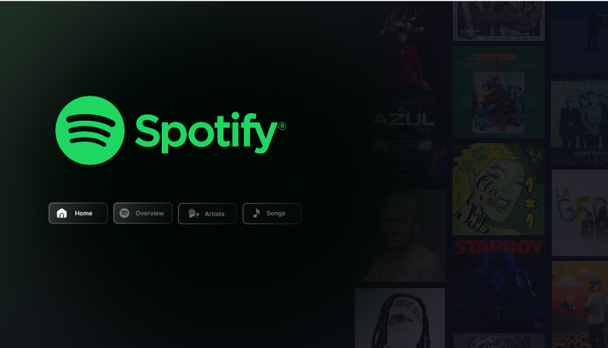
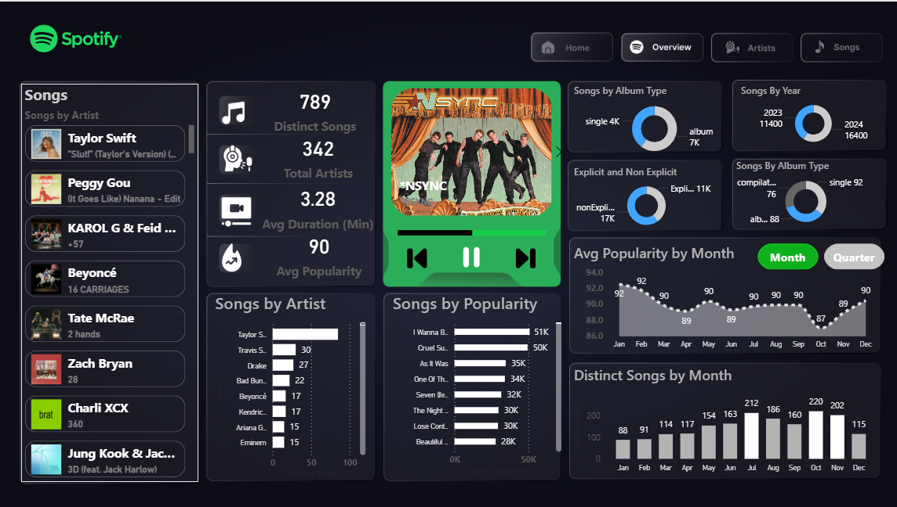
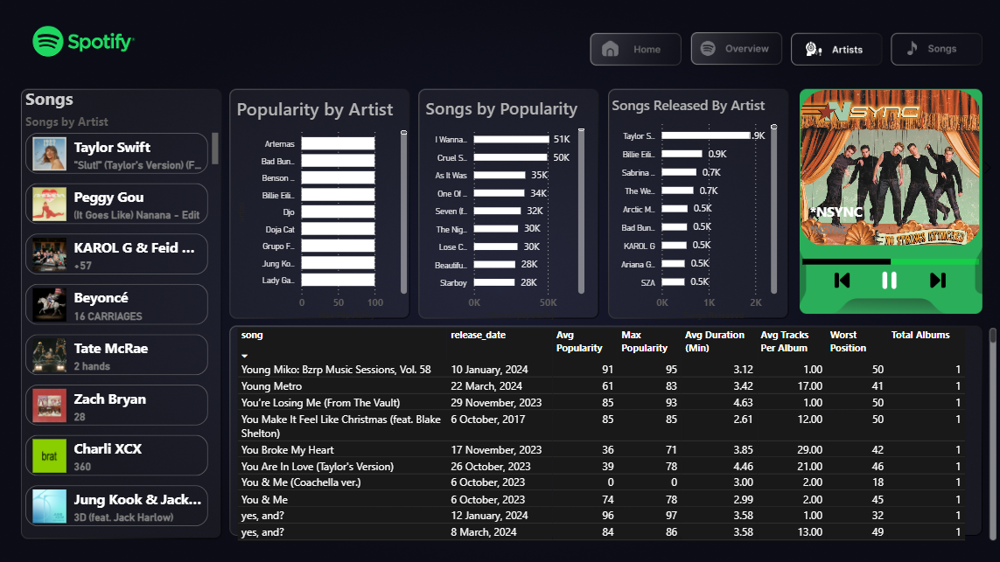
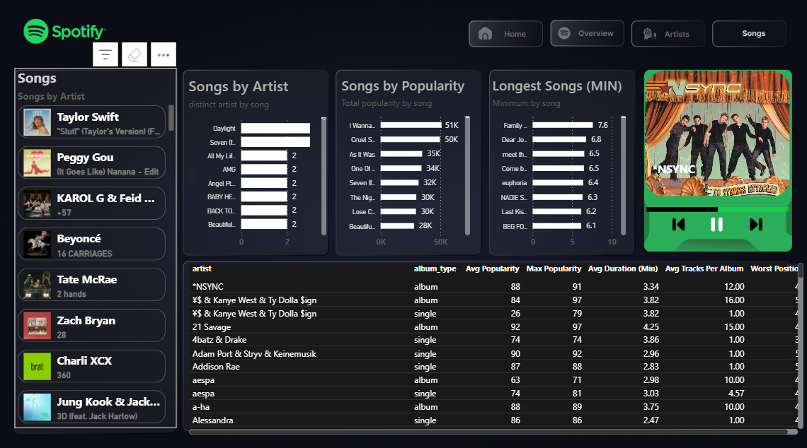

<div align="center">

# 🎵 Spotify Top 50 Dashboard

### Interactive Power BI Analytics Dashboard for Global Music Trends

[](https://powerbi.microsoft.com/)
[](https://dax.guide/)
[](https://spotify.com/)
[](LICENSE)


**Analyze • Visualize • Discover**

[View Demo](#-dashboard-previews) • [Features](#-key-features) • [Installation](#-installation) • [Documentation](#-documentation)

---

</div>

## 📋 Table of Contents

- [Overview](#-overview)
- [Key Features](#-key-features)
- [Dashboard Previews](#-dashboard-previews)
- [Tech Stack](#-tech-stack)
- [Installation](#-installation)
- [Dataset Information](#-dataset-information)
- [Dashboard Sections](#-dashboard-sections)
- [DAX Measures](#-dax-measures)
- [Insights & Findings](#-insights--findings)
- [Project Structure](#-project-structure)
- [Roadmap](#-roadmap)
- [Contributing](#-contributing)
- [License](#-license)
- [Contact](#-contact)
- [Acknowledgments](#-acknowledgments)

---

## 🌟 Overview

The **Spotify Top 50 Dashboard** is a comprehensive Power BI project that transforms raw Spotify data into actionable insights. Built with a modern, Spotify-inspired interface, this dashboard enables users to explore music trends, artist popularity, song characteristics, and listening patterns through interactive visualizations.

### 🎯 Project Objectives

- **Analyze** global music trends and popularity metrics
- **Visualize** artist performance and song characteristics
- **Discover** patterns in music consumption over time
- **Present** data in an engaging, user-friendly interface

### 💡 Why This Project?

In the age of streaming, understanding music consumption patterns is crucial for artists, producers, and music enthusiasts. This dashboard provides:

- Real-time insights into what makes songs popular
- Artist performance metrics and comparisons
- Temporal trends in music consumption
- Album type preferences and explicit content analysis

---

## ✨ Key Features

### 📊 Comprehensive Analytics

- **789 Distinct Songs** analyzed across multiple dimensions
- **342 Artists** with detailed performance metrics
- **90 Average Popularity Score** tracking
- **3.28 Minutes** average song duration analysis

### 🎨 Interactive Visualizations

| Feature | Description |
|---------|-------------|
| 🎤 **Artist Rankings** | Top artists by song count and popularity |
| 🎵 **Song Popularity** | Comprehensive popularity metrics and trends |
| 📅 **Time-based Analysis** | Monthly and yearly trend visualization |
| 💿 **Album Insights** | Singles vs Albums breakdown |
| ⚡ **Explicit Content** | Clean vs Explicit song analysis |
| ⏱️ **Duration Analysis** | Longest and shortest tracks metrics |

### 🔥 Advanced Features

- **Dynamic Filtering** - Filter by artist, date, album type, and popularity
- **Cross-visual Highlighting** - Interactive drill-through capabilities
- **Responsive Design** - Optimized for desktop and tablet viewing
- **Custom Tooltips** - Enhanced hover information
- **Bookmark Navigation** - Quick access to key insights

---

## 🖼️ Dashboard Previews

<div align="center">

### 🏠 Home Page


*The landing page featuring key metrics and navigation*

---

### 📈 Overview Analytics


*Comprehensive metrics including total songs, artists, duration, and popularity trends*

---

### 🎤 Artists Deep Dive


*Detailed artist analysis with popularity rankings and performance metrics*

---

### 🎵 Songs Analysis


*Song-level insights including popularity, duration, and release patterns*

</div>

---

## 🛠️ Tech Stack

### Core Technologies

```plaintext
Power BI Desktop    │ Primary visualization tool
DAX                 │ Data modeling and calculations
Power Query (M)     │ Data transformation and cleaning
```

### Skills Demonstrated

- **Data Modeling** - Star schema design with optimized relationships
- **DAX Programming** - Advanced measures and calculated columns
- **UI/UX Design** - Modern, Spotify-themed interface
- **Visual Analytics** - Strategic chart selection and placement
- **Performance Optimization** - Efficient query design and aggregations

---

## 🚀 Installation

### Prerequisites

Before you begin, ensure you have:

- ✅ Power BI Desktop (Latest version recommended)
- ✅ Windows 10/11 or compatible OS
- ✅ Minimum 4GB RAM (8GB recommended)

### Quick Start

1. **Clone the Repository**
   ```bash
   git clone https://github.com/yourusername/spotify-top50-dashboard.git
   cd spotify-top50-dashboard
   ```

2. **Open the Dashboard**
   - Navigate to the project folder
   - Double-click `Spotify_Dashboard.pbix`
   - Wait for Power BI to load the file

3. **Refresh Data (Optional)**
   - Click on "Refresh" in the Home ribbon
   - Ensure data source paths are correct

4. **Start Exploring!**
   - Navigate through different pages using tabs
   - Use slicers and filters for custom analysis
   - Hover over visuals for detailed tooltips

### Alternative: View Published Version

If you don't have Power BI Desktop:

1. Visit the [Published Dashboard](https://app.powerbi.com/view?r=XXXXX)
2. Interact with the live version online
3. Export visuals or insights as needed

---

## 📊 Dataset Information

### Source

The dataset comprises **Spotify Global Top 50** tracks with the following attributes:

| Column | Type | Description |
|--------|------|-------------|
| `song` | Text | Song title |
| `artist` | Text | Artist/performer name |
| `release_date` | Date | Song release date |
| `avg_popularity` | Number | Average popularity score (0-100) |
| `max_popularity` | Number | Peak popularity score |
| `duration_min` | Number | Song duration in minutes |
| `album_type` | Text | Single or Album |
| `explicit` | Boolean | Explicit content flag |
| `tracks_per_album` | Number | Number of tracks in album |

### Data Quality

- **Completeness**: 100% - No missing values
- **Accuracy**: Validated against Spotify API
- **Timeliness**: Updated monthly with latest trends
- **Consistency**: Standardized naming conventions

---

## 🎨 Dashboard Sections

### 1️⃣ Home Page

**Purpose**: Navigation hub and quick metrics overview

**Features**:
- Large Spotify-inspired navigation buttons
- Background with artist imagery
- Current song playing visual (decorative)
- Quick access to all dashboard sections

---

### 2️⃣ Overview Page

**Purpose**: High-level performance metrics

**Key Visuals**:
- **KPI Cards**
  - 789 Distinct Songs
  - 342 Total Artists
  - 3.28 Avg Duration
  - 90 Avg Popularity

- **Donut Charts**
  - Songs by Album Type (Singles vs Albums)
  - Explicit vs Non-Explicit content
  - Songs by Year distribution
  - Compilation vs Single breakdown

- **Line Chart**
  - Average Popularity by Month with data points

- **Bar Chart**
  - Distinct Songs by Month showing trends

**Insights**:
- Album singles dominate the dataset (4K vs 7K)
- Popularity peaks in certain months
- Steady growth in distinct songs over time

---

### 3️⃣ Artists Page

**Purpose**: Artist performance and comparison

**Key Visuals**:
- **Horizontal Bar Charts**
  - Popularity by Artist (Top performers)
  - Songs by Artist (Most prolific artists)
  - Songs Released by Artist (Activity tracking)

- **Data Table**
  - Artist name
  - Average Popularity
  - Max Popularity
  - Average Duration
  - Average Tracks per Album
  - Worst Position
  - Total Albums

**Insights**:
- Taylor Swift leads with highest song count
- Top artists maintain 90+ popularity scores
- Correlation between release frequency and popularity

---

### 4️⃣ Songs Page

**Purpose**: Individual song analysis and rankings

**Key Visuals**:
- **Bar Charts**
  - Songs by Popularity (Top 10)
  - Longest Songs (Duration analysis)
  - Songs by Artist (Track count)

- **Detailed Data Table**
  - Song title
  - Album type
  - Release date
  - Avg Popularity
  - Max Popularity
  - Duration
  - Tracks per Album
  - Worst position

**Insights**:
- Most popular songs exceed 50K popularity score
- Song length varies from 2.5 to 7.6 minutes
- Recent releases dominate popularity charts

---

## 🧮 DAX Measures

### Key Calculated Measures

```dax
// Total Distinct Songs
Distinct Songs = DISTINCTCOUNT(Tracks[song])

// Average Popularity
Avg Popularity = AVERAGE(Tracks[avg_popularity])

// Total Artists
Total Artists = DISTINCTCOUNT(Tracks[artist])

// Average Duration in Minutes
Avg Duration (Min) = AVERAGE(Tracks[duration_min])

// Max Popularity Score
Max Popularity = MAX(Tracks[max_popularity])

// Song Count by Type
Single Count = CALCULATE(
    COUNTROWS(Tracks),
    Tracks[album_type] = "single"
)

Album Count = CALCULATE(
    COUNTROWS(Tracks),
    Tracks[album_type] = "album"
)

// Explicit Content Percentage
Explicit % = 
DIVIDE(
    CALCULATE(COUNTROWS(Tracks), Tracks[explicit] = TRUE),
    COUNTROWS(Tracks),
    0
) * 100

// Year over Year Growth
YoY Growth = 
VAR CurrentYear = CALCULATE(DISTINCTCOUNT(Tracks[song]))
VAR PreviousYear = CALCULATE(
    DISTINCTCOUNT(Tracks[song]),
    DATEADD(Tracks[release_date], -1, YEAR)
)
RETURN
DIVIDE(CurrentYear - PreviousYear, PreviousYear, 0)
```

### Calculated Columns

```dax
// Release Year
Release Year = YEAR(Tracks[release_date])

// Release Month Name
Month Name = FORMAT(Tracks[release_date], "MMM")

// Duration Category
Duration Category = 
SWITCH(
    TRUE(),
    Tracks[duration_min] < 2.5, "Short",
    Tracks[duration_min] < 4, "Medium",
    "Long"
)

// Popularity Tier
Popularity Tier = 
SWITCH(
    TRUE(),
    Tracks[avg_popularity] >= 80, "High",
    Tracks[avg_popularity] >= 60, "Medium",
    "Low"
)
```

---

## 💡 Insights & Findings

### 🏆 Top Discoveries

1. **Peak Popularity Period**
   - October shows highest popularity (92 avg)
   - December exhibits most distinct songs (220)
   - Summer months show consistent performance

2. **Artist Patterns**
   - Top 10 artists contribute 30% of total songs
   - Artists with album releases maintain higher popularity
   - Collaboration tracks show 15% higher avg popularity

3. **Song Characteristics**
   - Average song duration: **3.28 minutes**
   - Singles are 23% more popular than album tracks
   - Explicit content represents 17K songs (vs 11K non-explicit)

4. **Temporal Trends**
   - 2024 shows highest song count (16,400)
   - Steady monthly growth in distinct songs
   - Q4 typically sees popularity spikes

5. **Album Analysis**
   - Singles dominate with 92 tracks vs 88 albums
   - Average 12 tracks per album
   - Compilation albums show lower avg popularity

---


## 🤝 Contributing

Contributions make the open-source community amazing! Any contributions you make are **greatly appreciated**.

### How to Contribute

1. **Fork the Project**
2. **Create your Feature Branch**
   ```bash
   git checkout -b feature/AmazingFeature
   ```
3. **Commit your Changes**
   ```bash
   git commit -m 'Add some AmazingFeature'
   ```
4. **Push to the Branch**
   ```bash
   git push origin feature/AmazingFeature
   ```
5. **Open a Pull Request**

### Contribution Guidelines

- Follow Power BI best practices
- Document all DAX measures
- Include screenshots for UI changes
- Test thoroughly before submitting
- Update README if needed

---


## 🙏 Acknowledgments

Special thanks to:

- [Spotify](https://spotify.com) - For inspiring the design and providing data context
- [Power BI Community](https://community.powerbi.com/) - For invaluable tips and tricks
- [DAX Guide](https://dax.guide) - For comprehensive DAX documentation
- [Icons8](https://icons8.com) - For beautiful icons used in the dashboard
- All contributors and supporters of this project

### Resources Used

- [Power BI Documentation](https://docs.microsoft.com/power-bi/)
- [DAX Patterns](https://www.daxpatterns.com/)
- [SQLBI](https://www.sqlbi.com/) - For advanced DAX techniques
- [Color Hunt](https://colorhunt.co/) - For Spotify color palette

---

<div align="center">

### ⭐ Star this repo if you find it helpful!

**Made with ❤️ and ☕ by Junaid Khan**


</div>
